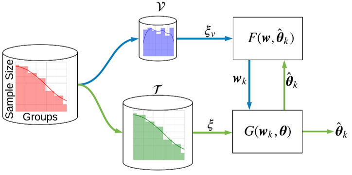
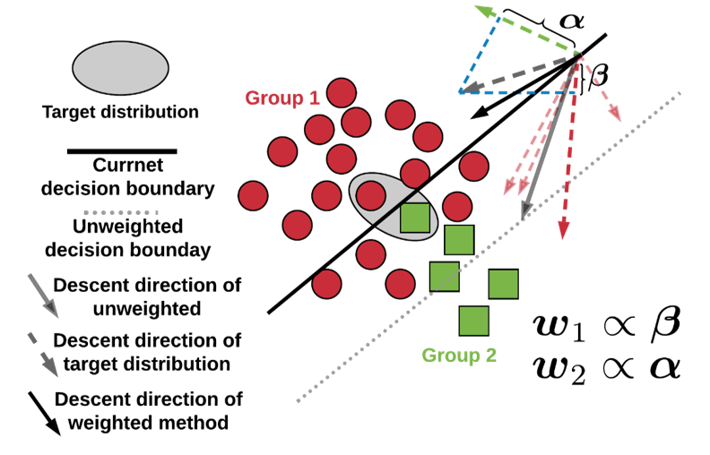

# Targeted Meta-Learning
This repository is the official implementation of the framework called **Targeted Meta-Learning** (or **Targeted Data-driven Regularization**) and proposed in the following publications (use the references at the end of this page for citing this work when you use this framework):

1. Kamani, Mohammad Mahdi, et al. "Targeted Data-driven Regularization for Out-of-Distribution Generalization." Proceedings of the 26th ACM SIGKDD International Conference on Knowledge Discovery & Data Mining. 2020. [[pdf](https://www.researchgate.net/profile/Mohammad_Mahdi_Kamani/publication/343776852_Targeted_Data-driven_Regularization_for_Out-of-Distribution_Generalization/links/5f43a8be92851cd302225b81/Targeted-Data-driven-Regularization-for-Out-of-Distribution-Generalization.pdf)]

2. Kamani, Mohammad Mahdi, et al. "Targeted meta-learning for critical incident detection in weather data." Proc. of the International Conference on Machine Learning, Workshop on Climate Change: How Can AI Help. 2019. [[pdf](https://www.researchgate.net/profile/Mohammad_Mahdi_Kamani/publication/336935529_Targeted_Meta-Learning_for_Critical_Incident_Detection_in_Weather_Data/links/5dbb88b34585151435dadf96/Targeted-Meta-Learning-for-Critical-Incident-Detection-in-Weather-Data.pdf)]

<p align="center">
  
</p>

This framework is designed to address the problem of bias in training of machine learning models from a biased dataset. The primary application could be training from an imbalanced dataset using a bilevel approach similar to meta-learning tasks. As shwon in the above image, in this framework, we propose a bilevel structure, where the inner level is the normal training with weighted loss for different classes or groups in the dataset. In the outer level, we optimize for those weights using a small target dataset that is free of the bias. For instance, if the training dataset is imbalanced, the target dataset is small balanced set of all classes. As explained in the following image, this framework is supposed to guide the main learning process not to drift toward the biased model using the weight update in the outer level.

<p align="center">
  
</p>


## Getting Started

First, you need to install the requirements using the following command:
```bash
[sudo] pip install -r requirements.txt
```

### Generating Dataset
For the sake of experiment, you could use the following command to generating an imabalnced or a long-tailed dataset from MNIST or CIFAR datasets. To do that, you can run this command:
```bash
python makeImbalanceDataset.py --data-dir ./data/mnist_23_0995 \
                               --dataset mnist \
                               --train-size 5000 \
                               --validation-size 20 \
                               --test-size 1000 \
                               --ratio 0.995 \
                               --minority-labels 2 \
                               --majority-labels 3
```
This command will generate a binary dataset from the MNIST dataset using two of its classes, namely, `2` and `3`. The class `3` will be the majority class and the class `2` will be the minorty class. The ratio between the size of these two classes is set to 0.995, which means that in every 1000 images in the dataset, only 5 of them are from the minority class and 995 of them are from the majority class, which makes it heavily imbalanced. This code will generate three files, that are `train.tfrecords`, `test.tfrecords`, and `validation.tfrecords`. The validation dataset is the small dataset where the classes are balanced. In this case it is of size 20, 10 of which are from class `2` and the other 10 are from class `3`. If you want to use you own dataset, follow the same pattern and create the target dataset in a `validation.tfrecords` file. When the dataset is loaded using functions in `load_dataset.py` it will load train and validation datasets together for the training purposes.

Then, need to run the training using a defined `BilevelModel` class in `model.py`. Note that you could define your own model for training in this framework by inheriting from this class and following the same way it has been done for `BilevelResNet` and `BilevelConvNet` classes in the `model.py`. For instance for the ConvNet model we use a simple code to make its Bilevel version as follows:
```python
class BilevelConvNet(BilevelModel):
	def __init__(self, num_class=2):
		super(BilevelConvNet, self).__init__()
		self.num_class = num_class
		self.conv1 = tf.keras.layers.Conv2D(filters=32,
																	kernel_size=3,
																	activation=tf.nn.relu)
		self.conv2 = tf.keras.layers.Conv2D(filters=64,
																	kernel_size=3,
																	activation=tf.nn.relu)
		self.max_pool1 = tf.keras.layers.MaxPooling2D(pool_size=2, strides=2)
		self.dropout1 = tf.keras.layers.Dropout(0.25)

		self.conv3 = tf.keras.layers.Conv2D(filters=128,
																	kernel_size=3,
																	activation=tf.nn.relu)
		self.max_pool2 = tf.keras.layers.MaxPooling2D(pool_size=2, strides=2)
		self.conv4 = tf.keras.layers.Conv2D(filters=128,
																	kernel_size=3,
																	activation=tf.nn.relu)
		self.max_pool3 = tf.keras.layers.MaxPooling2D(pool_size=2, strides=2)
		self.dropout2 = tf.keras.layers.Dropout(0.25)

		self.flatten = tf.keras.layers.Flatten()

		self.fc1 = tf.keras.layers.Dense(units=1024, activation=tf.nn.relu)
		self.dropout3 = tf.keras.layers.Dropout(0.25)
		self.fc3 = tf.keras.layers.Dense(units=self.num_class)

	def call(self, input, training=True):
		del training
		input = input/128-1
		out = input
		for layer in self.layers:
			out = layer(out)
		return out
```

Now that we have the dataset and defined our model we can use the following command to run our training using `Estimator` API of Tensorflow.


```bash
python main.py --data-dir ./data/mnist_23_0995 \ 
               --dataset mnist \
               --job-dir ./runs/ \
               --num-training-samples 5000 \
               --eval \
               --train-steps 20000 \
               --eval-freq 1000\
               --log-freq 100
```
This will run the training for 20K steps, performs evaluation on the test dataset every 1000 steps of training and reports the logs of training every 100 steps.

## Notes
This reposirtory has been developed using Tensorflow `1.x` API using its Estimator API, and recently has been adapted to the Tensorflow `2.x` API. There might be some errors that prevent this code from running in Tensorflow `2.x` API. Please report these bugs through issues, so we can update the code accordingly.


## References 
Please use the following bibitems to cite our works whenever you use this framework.
```ref
@inproceedings{kamani2020targeted,
  title={Targeted Data-driven Regularization for Out-of-Distribution Generalization},
  author={Kamani, Mohammad Mahdi and Farhang, Sadegh and Mahdavi, Mehrdad and Wang, James Z},
  booktitle={Proceedings of the 26th ACM SIGKDD International Conference on Knowledge Discovery \& Data Mining},
  pages={882--891},
  year={2020}
}
@inproceedings{kamani2019targeted,
  title={Targeted meta-learning for critical incident detection in weather data},
  author={Kamani, Mohammad Mahdi and Farhang, Sadegh and Mahdavi, Mehrdad and Wang, James Z},
  booktitle={Proc. of the International Conference on Machine Learning, Workshop on Climate Change: How Can AI Help},
  year={2019}
}
```
